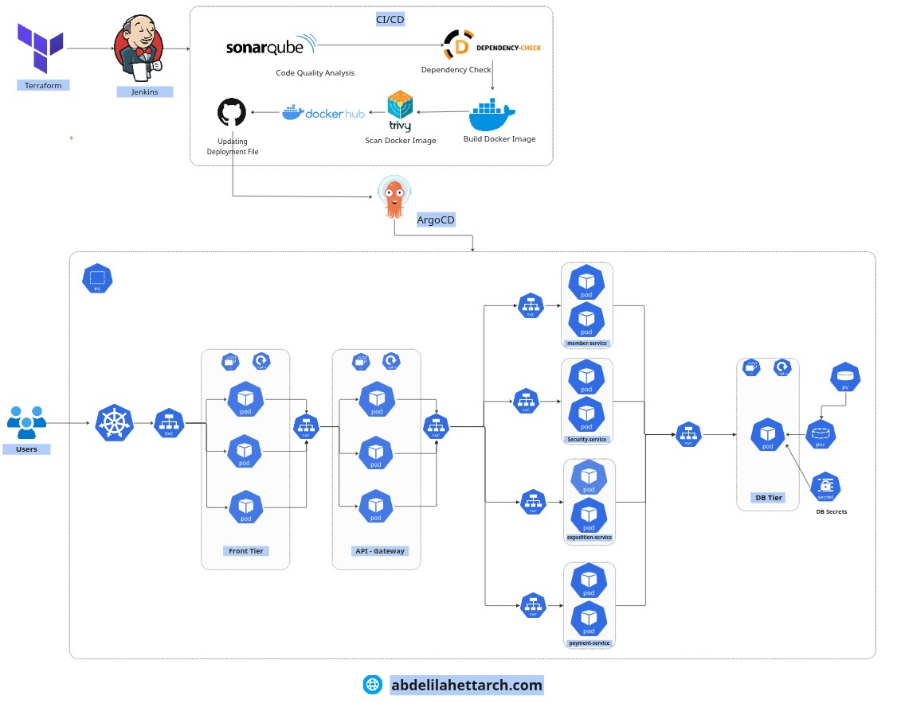
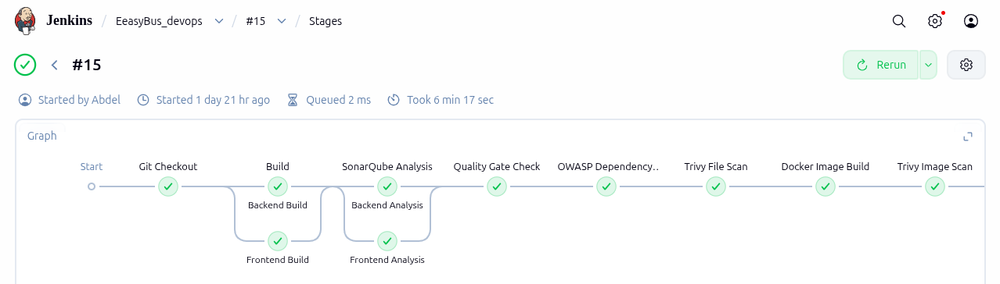
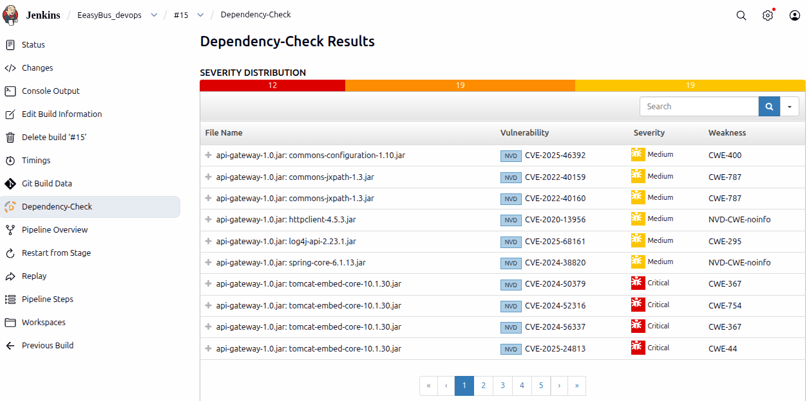
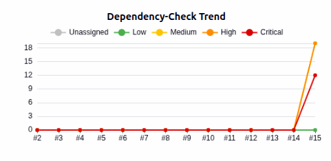
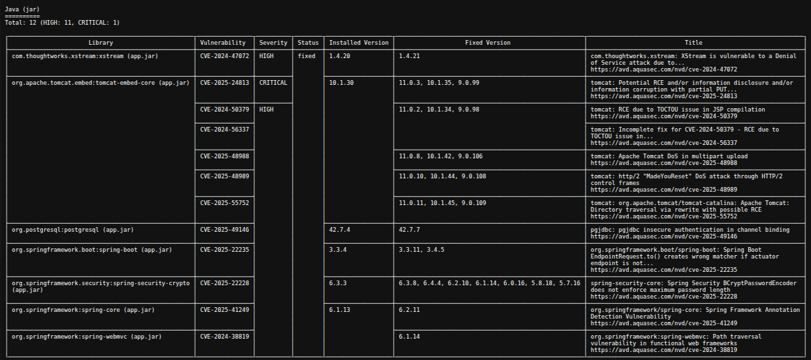
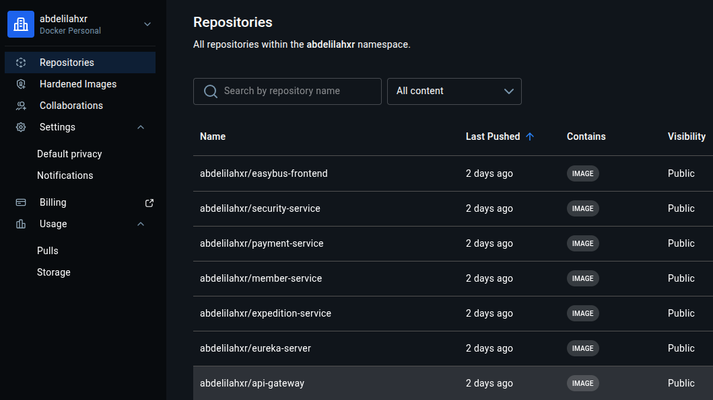
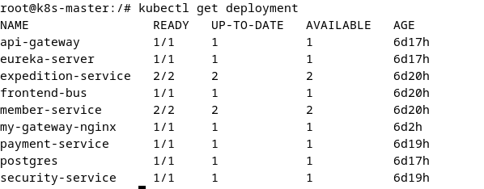
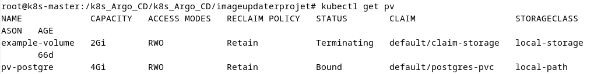
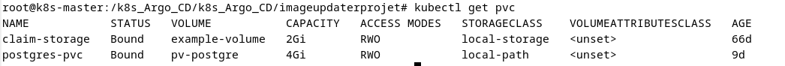
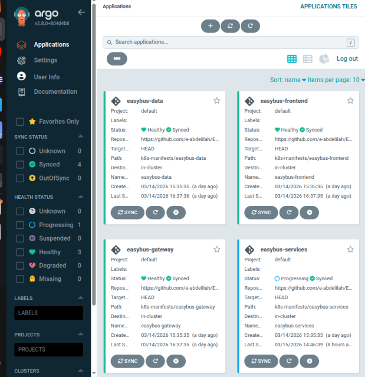

# Automated DevSecOps Pipeline with GitOps & Kubernetes for EasyBus, a bus ticket management platform.

> Automated DevSecOps Pipeline with GitOps & Kubernetes for EasyBus, a bus ticket management platform.

<p>
  
  
  
  
  
  
  
  
</p>

This project demonstrates a complete **shift-left DevSecOps** chain: security and quality controls are integrated from the very first stage of the CI/CD pipeline, all the way through to an automated GitOps deployment on Kubernetes.



---

## Table of Contents

- [About the Application](#about-the-application)
- [Application Architecture](#application-architecture)
- [Tech Stack](#tech-stack)
- [DevSecOps Pipeline (CI)](#devsecops-pipeline-ci)
  - [1. Source & Build](#1-source--build)
  - [2. SAST — SonarQube](#2-sast--sonarqube)
  - [3. SCA — OWASP Dependency-Check](#3-sca--owasp-dependency-check)
  - [4. Trivy — File & Image Scanning](#4-trivy--file--image-scanning)
  - [5. Build & Push to Docker Hub](#5-build--push-to-docker-hub)
- [Continuous Delivery (CD)](#continuous-delivery-cd)
  - [Kubernetes Deployment](#kubernetes-deployment)
  - [GitOps with Argo CD](#gitops-with-argo-cd)
  - [Argo CD Image Updater](#argo-cd-image-updater)
- [Infrastructure as Code](#infrastructure-as-code)
- [Getting Started (Local)](#getting-started-local)
- [Project Structure](#project-structure)
- [Authors](#authors)

---

## About the Application

EasyBus is a web platform that dematerializes interurban bus ticketing, acting as a trusted intermediary between travelers and transport companies. It centralizes offers from multiple companies, lets travelers search trips and buy tickets online, and gives companies autonomous management of their expeditions (trips).

**Actors:**
- **Customer** — searches and books trips, manages profile and payment methods.
- **Company** — creates and manages expeditions (schedule, price, capacity).
- **Admin** — validates company registrations and admin co-options.

The application follows a strict **microservices architecture**  with synchronous **REST** communication, and full containerization.

---

## Application Architecture

The system uses an **Edge / API Gateway pattern**: the React frontend never talks to business services directly — every request flows through the API Gateway.

| Service | Role | Port |
|---|---|---|
| **Frontend** | React SPA (presentation layer) | 80 / 5173 |
| **API Gateway** | Routing, session handling (`CookieDTO`) | 8080 |
| **Eureka Server** | Service discovery | 8761 |
| **Security Service** | Authentication & session lifecycle | 8084 |
| **Member Service** | Users (Customers, Companies, Admins) | 8081 |
| **Expedition Service** | Trips & tickets business logic | 8082 |
| **Payment Service** | Payment methods | 8083 |
| **PostgreSQL** | One instance, 4 logical DBs (`securityDB`, `memberDB`, `expeditionDB`, `paymentDB`) | 5432 |

**Security highlights:** stateful session-based auth, hashed passwords, RBAC enforced at service level, strict data isolation (a service can only reach another service's data via API), and DTOs to avoid exposing entities.

---

## Tech Stack

| Layer | Technologies |
|---|---|
| **Frontend** | React 19, Vite, React Router DOM |
| **Backend** | Java 21, Spring Boot 3.3.4, Spring Cloud (Eureka) |
| **Database** | PostgreSQL 15, Hibernate / Spring Data JPA, pgAdmin 4 |
| **Source Control** | Git + GitHub |
| **CI** | Jenkins (pipeline as code) |
| **SAST** | SonarQube |
| **SCA** | OWASP Dependency-Check |
| **Container scanning** | Trivy (filesystem & image) |
| **Containers** | Docker, Docker Hub registry |
| **Orchestration** | Kubernetes  |
| **CD / GitOps** | Argo CD + Argo CD Image Updater |
| **IaC** | Terraform (Azure) |

---

## DevSecOps Pipeline (CI)

The entire CI flow is defined as code in the [`JenkinsFile`](JenkinsFIle). Each commit triggers a Jenkins pipeline that transforms integration into a **chain of trust**: any critical failure (failed tests, SonarQube Quality Gate failure, blocking vulnerabilities) aborts the pipeline and prevents bad artifacts from reaching production.



**Pipeline stages:** `Git Checkout → Build → SonarQube Analysis → Quality Gate → OWASP Dependency-Check → Trivy File Scan → Docker Build → Trivy Image Scan → Docker Hub Push`

### 1. Source & Build

Jenkins checks out the source from GitHub using secured credentials (`git-cred`), then builds the **frontend (React)** and the **six backend services (Spring Boot)** in **parallel** to cut the overall build time.

### 2. SAST — SonarQube

After compilation, the code undergoes static analysis with **SonarQube**. Each backend microservice (Gateway, Eureka, Security, Member, Expedition, Payment) is analyzed individually, and the frontend is scanned via `sonar-scanner`.

A **Quality Gate Check** acts as an automated barrier (`waitForQualityGate abortPipeline: true`): if the code does not meet the predefined security and quality thresholds, the pipeline stops immediately.


### 3. SCA — OWASP Dependency-Check

**OWASP Dependency-Check** scans all third-party libraries used by the Java services to identify known vulnerabilities (CVEs) **before** they are baked into images.





### 4. Trivy — File & Image Scanning

**Trivy** is used twice:

- **File Scan** — scans the whole repository for misconfigurations and accidentally committed secrets (`trivy fs --severity HIGH,CRITICAL`).
- **Image Scan** — inspects each built Docker image layer for vulnerabilities in the base OS and system packages, **before** pushing to the registry (`trivy image --severity HIGH,CRITICAL`).



### 5. Build & Push to Docker Hub

Once images are certified "clean", they are tagged with a version number and pushed to **Docker Hub** (`abdelilahxr`) using encrypted credentials. These images are then pulled by Argo CD for deployment.



---

## Continuous Delivery (CD)

### Kubernetes Deployment

The platform runs on a **Kubernetes** cluster, organized into namespaces per architectural layer: `easybus-frontend`, `easybus-gateway`, `easybus-services`, `easybus-data`.

Core resources include **Deployments**, **Services**, **Ingress / API Gateway**, **ConfigMaps**, **Secrets** (Bitnami **Sealed Secrets** for sensitive data), **Persistent Volumes** and **Persistent Volume Claims**.







### GitOps with Argo CD

Deployment follows the **GitOps** model — Git is the single source of truth for the desired state. The Kubernetes manifests live in [`k8s-manifests/`](k8s-manifests/), and **Argo CD** continuously synchronizes the cluster with Git, guaranteeing traceability, auditability, and reproducibility.



### Argo CD Image Updater

**Argo CD Image Updater** automates image version management end to end:

1. Jenkins builds a new Docker image.
2. The image is pushed to Docker Hub.
3. Image Updater detects the new version (semver strategy).
4. It writes the updated tag back to the Kubernetes manifests in Git.
5. Argo CD syncs and rolls out the new deployment on the cluster.

This gives fully automated, hands-off deployments with consistency between images and manifests, and complete version traceability via Git.

---

## Infrastructure as Code

The cloud infrastructure is provisioned with **Terraform** on **Azure**, split into modules under [`Terraform/`](Terraform/):

- `networking/` — resource group, virtual network, subnets.
- `servers/` — compute / cluster nodes.
- `app-gateway/` — Azure Application Gateway.
- `waf/` — Web Application Firewall rules.

---

## Getting Started (Local)

The full stack can be run locally with Docker Compose:

```bash
# Build and start all services
docker compose up --build
```

Once running:

| Service | URL |
|---|---|
| Frontend | http://localhost:3000 |
| API Gateway | http://localhost:8080 |
| Eureka Dashboard | http://localhost:8761 |
| pgAdmin | http://localhost:5051 |
| PostgreSQL | localhost:5432 |

Databases are auto-initialized from [`db/init/`](db/init/) (`securityDB`, `memberDB`, `expeditionDB`, `paymentDB`).

---

## Project Structure

```
EeasyBus/
├── backend/                # Spring Boot microservices
│   ├── api-gateway/
│   ├── eureka-server/
│   ├── security-service/
│   ├── member-service/
│   ├── expedition-service/
│   └── payment-service/
├── frontend/               # React + Vite SPA
├── db/init/                # SQL init scripts (DB-per-service)
├── k8s-manifests/          # Kubernetes manifests (GitOps source of truth)
│   ├── argocd-apps/        # Argo CD Application definitions
│   ├── easybus-frontend/
│   ├── easybus-gateway/
│   ├── easybus-services/
│   ├── easybus-data/
│   └── namespaces/
├── Terraform/              # Azure IaC (networking, servers, app-gateway, waf)
├── docker-compose.yml      # Local development stack
├── JenkinsFIle             # CI/CD pipeline as code
└── images/                 # Diagrams & screenshots
```

---

## Author

**ETTARCH Abdelilah**

[](https://abdelilahettarch.com)
[](https://www.linkedin.com/in/abdelilahettarch/)

